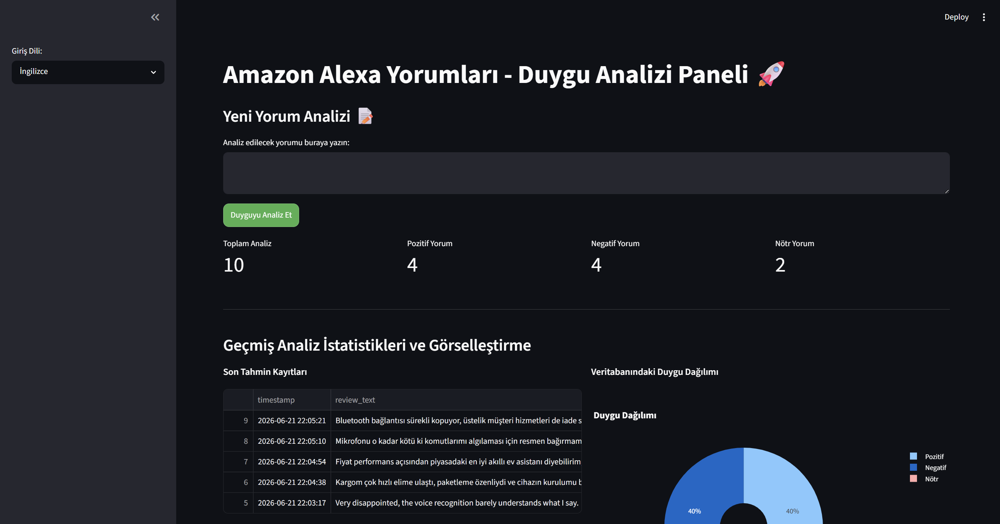
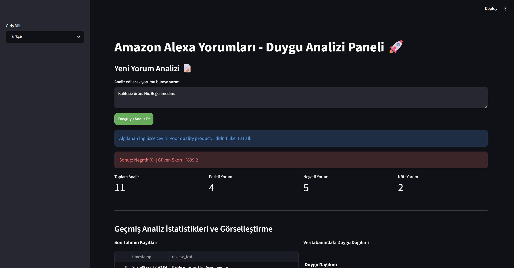
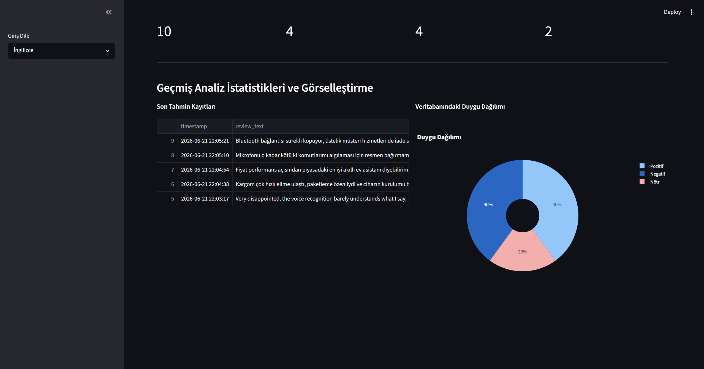

# Amazon Alexa Yorumları - Duygu Analizi Gösterge Paneli 🚀

Bu proje; müşteri yorumlarını otomatik olarak Pozitif, Negatif veya Nötr olarak sınıflandıran, sonuçları analiz ve raporlama amacıyla bir SQL veritabanında saklayan uçtan uca bir Duygu Analizi Gösterge Paneli uygulamasıdır.

## 📌 Sistem Tasarımı
Proje mimarisi üç ana katmandan oluşmaktadır:
1. **NLP ve Model Eğitim Katmanı:** Ham metinlerin temizlenmesi, TF-IDF ile vektörleştirilmesi ve makine öğrenmesi modellerinin eğitilmesi.
2. **Kullanıcı Arayüzü (Frontend):** Streamlit platformu üzerinde geliştirilmiş; kullanıcı dostu, emojilerle zenginleştirilmiş ve CSS ile özelleştirilmiş dinamik panel.
3. **Veri ve Analitik Katmanı (Backend):** Tahmin edilen duyguların, güven skorlarının ve zaman damgalarının SQLite veritabanına işlenmesi ve Plotly ile anlık görselleştirilmesi.

## 🌐 Öne Çıkan Özellik: Çoklu Dil Desteği (TR / EN)
Uygulama, küresel müşteri deneyimini simüle etmek amacıyla dinamik bir dil seçim modülüne sahiptir:
* **Giriş Dili Seçimi:** Kullanıcılar sol panelden (Sidebar) "İngilizce" veya "Türkçe" seçimini yapabilirler.
* **Google Translate API Entegrasyonu:** Türkçe girilen yorumlar, arka planda otomatik olarak İngilizceye çevrilir ve modelin en yüksek doğrulukla çalışması sağlanır. Algılanan çeviri arayüzde şeffaf bir şekilde kullanıcıya gösterilir.

## 📊 Veri Seti Açıklaması
Projede, gerçek müşteri geri bildirimlerini içeren Kaggle [Amazon Alexa Reviews](https://www.kaggle.com/datasets/bittlingmayer/amazonreviews) veri seti kullanılmıştır. Metinler analiz süreçlerine girmeden önce küçük harfe dönüştürme, stopword (etkisiz kelimeler) kaldırma ve tokenization işlemlerinden geçirilmiştir.

## 🧠 Model Seçimi ve Gerekçesi
Sistem gereksinimleri doğrultusunda üç farklı algoritma eğitilmiş ve performansları karşılaştırılmıştır:
1. **Logistic Regression (Ana Model):** Doğrusal metin sınıflandırmasında sergilediği yüksek kararlılık ve `predict_proba` fonksiyonu ile arayüzdeki "Güven Skorunu" hesaplayabilmesi nedeniyle ana tahmin motoru olarak seçilmiştir.
2. **Support Vector Machine (SVM):** Yüksek boyutlu TF-IDF matrisleri üzerindeki sınır çizme başarısını test etmek amacıyla eğitilmiş ve %87.42 ile güçlü bir alternatif oluşturmuştur.
3. **Naive Bayes:** Kelime frekans olasılıklarına dayalı geleneksel metin sınıflandırma performansını ölçmek için dahil edilmiştir.

## 📈 Değerlendirme Sonuçları
Modeller Accuracy, Precision, Recall ve F1-Score ölçütlerine göre değerlendirilmiştir. Test seti üzerindeki başarı metrikleri şu şekildedir:

* **Logistic Regression (Ana Model):** Doğruluk (Accuracy) %88.00, F1-Score: 0.88
* **Support Vector Machine (SVM):** Doğruluk (Accuracy) %87.42
* **Naive Bayes:** Doğruluk (Accuracy) %85.08

**Model Kararsızlık Sınırı (Nötr):** Modelin pozitif olasılığı %35 ile %65 arasında kaldığında sistem "Nötr" kararı vererek hata payını minimize eder.

## 🗄️ SQL Veritabanı Yapısı
Arayüz üzerinden yapılan her sorgu, kalıcı analiz ve raporlama için SQLite veritabanındaki `predictions` tablosuna anlık olarak kaydedilir:
* `review_text`: Kullanıcının girdiği ham yorum metni.
* `predicted_sentiment`: Tahmin edilen duygu etiketi (1: Pozitif, 0: Negatif, 2: Nötr).
* `confidence_score`: Modelin tahminden ne kadar emin olduğunu gösteren güven skoru.
* `timestamp`: İşlemin gerçekleştirildiği net zaman damgası.

## 🛠️ Kurulum ve Çalıştırma Talimatları
Projeyi yerel ortamınızda ayağa kaldırmak için:

1. Projeyi klonlayın:
```bash
   git clone [https://github.com/brknaa/amazon-alexa-nlp-dashboard.git](https://github.com/brknaa/amazon-alexa-nlp-dashboard.git)
   cd amazon-alexa-nlp-dashboard

## 🖼️ Gösterge Paneli Ekran Görüntüleri

### Genel Arayüz ve Dil Seçimi


### Duygu Analizi ve Çeviri Sonucu


### Veritabanı İstatistikleri ve Plotly Grafikleri

